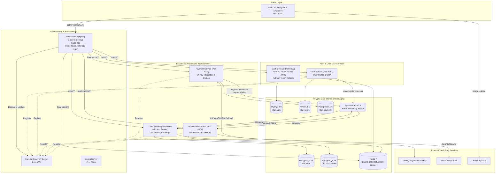
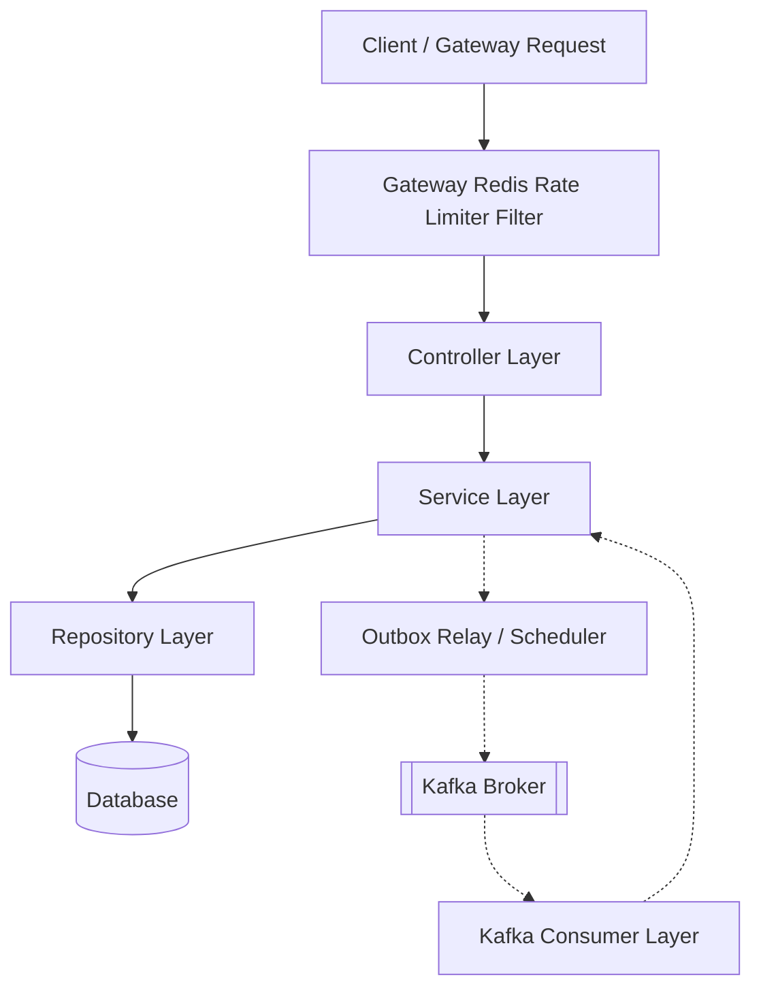
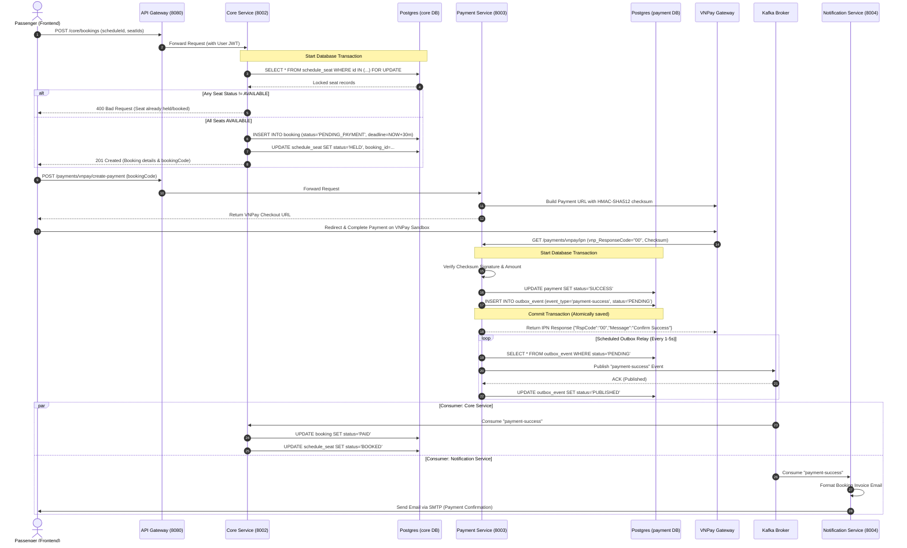
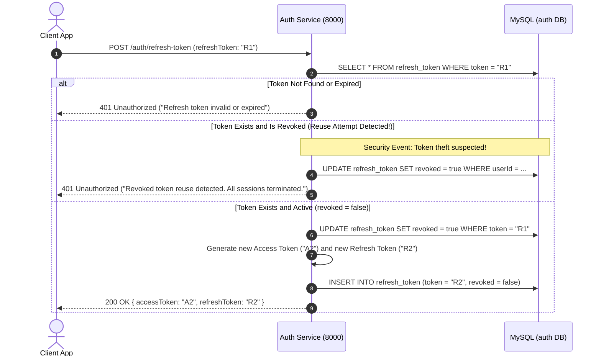
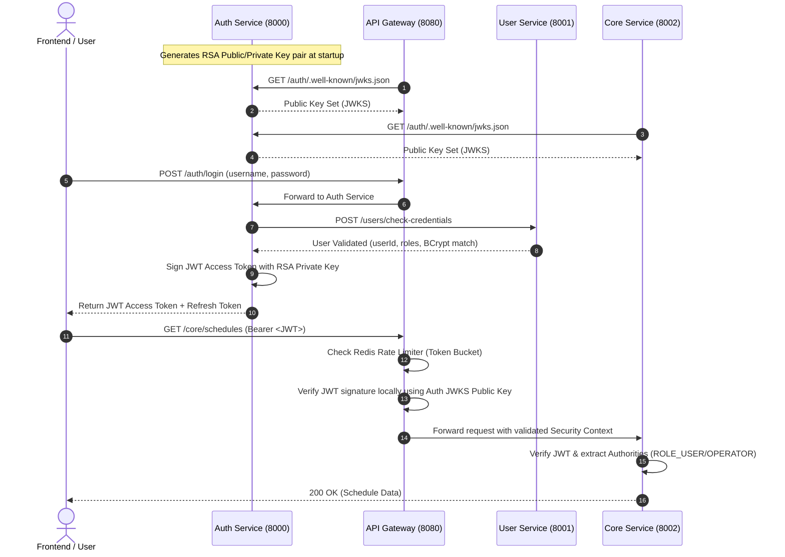
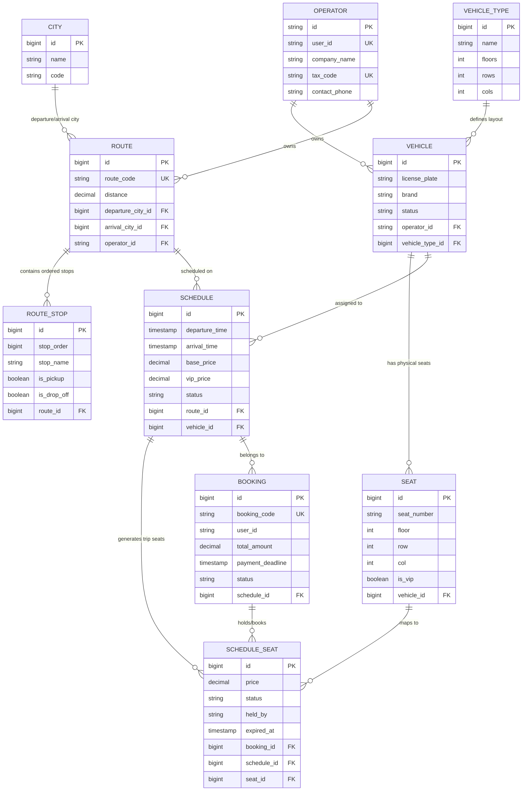
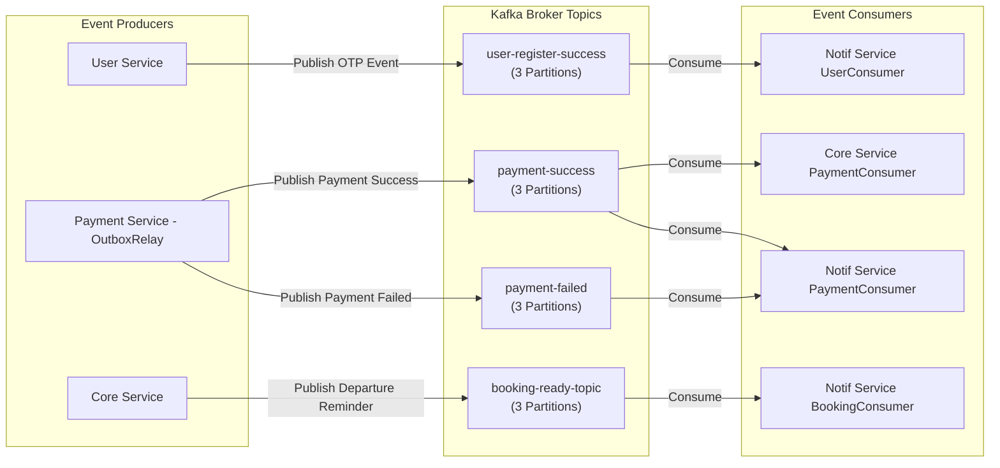
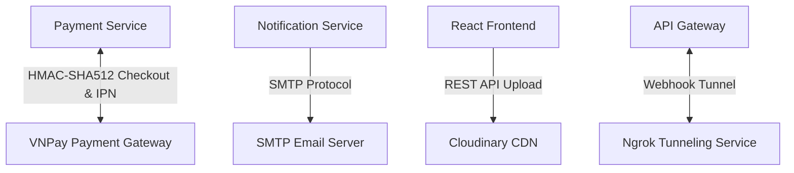

# Bus Booking System - Comprehensive Architecture Documentation

This document provides a deep technical analysis of the system architecture, component design, layer responsibilities, data flow pipelines, security protocols, database schemas, messaging infrastructure, and external service integrations for the **Bus Booking System**.

---

## 1. System Architecture Overview

The system is engineered as an **Event-Driven Microservices Architecture** utilizing the Spring Cloud ecosystem for backend orchestration and React 19 with Vite for the web frontend.



---

## 2. Package Structure & Module Blueprint

Each backend microservice follows a standard DDD-inspired (Domain-Driven Design) layered package structure:

```
<service-root>/
├── src/main/java/com/Man10h/<service_name>/
│   ├── config/             # Spring Security, Kafka, Redis, Web MVC configurations
│   ├── controller/         # REST Controllers & API Endpoints
│   ├── kafka/              # Kafka Consumers (@KafkaListener) & Producers
│   ├── model/
│   │   ├── dtos/           # Request & Response Data Transfer Objects
│   │   ├── entities/       # JPA Entity classes mapping to database tables
│   │   └── enums/          # Status and domain enumeration definitions
│   ├── repository/         # Spring Data JPA Repositories
│   ├── scheduler/          # Background cron jobs & periodic task handlers
│   ├── service/            # Interface & Implementation business logic
│   │   └── impl/           # Service concrete implementations
│   └── util/               # Utility classes (Crypto, Date formatters, Mappers)
└── src/main/resources/
    ├── application.yml     # Service configurations
    └── db/changelog/       # Liquibase SQL migration scripts
```

### Detailed Submodule Map

```
bus-booking-system/
├── api-gateway/            # Spring Cloud Gateway routing, JWKS JWT validation, Redis RateLimiter
│   ├── config/RateLimiterConfig.java   # RedisRateLimiter & KeyResolver beans
│   └── config/RouterConfig.java        # RequestRateLimiter filter pipeline
├── auth-service/           # OAuth2 Auth server, RS256 token provider, Token Rotation & Revocation
│   ├── repository/RefreshTokenRepository.java  # Token lookup & bulk revocation queries
│   └── service/impl/AuthServiceImpl.java        # Token Rotation & reuse detection
├── user-service/           # User lifecycle, OTP verification, credential check endpoint
├── core-service/           # Fleet, Route, Schedule, Booking & Pessimistic Seat Locking
├── payment-service/        # VNPay checkout, IPN handler, Transactional Outbox pattern
├── notification-service/   # Kafka event consumer, SMTP Mail dispatching
├── discovery-server/      # Netflix Eureka service discovery server
├── config-server/         # Centralized configuration management server
└── frontend/               # React 19 SPA (Vite + Tailwind v4 + Zustand)
```

---

## 3. Layer Responsibilities



| Layer | Component Responsibilities |
| :--- | :--- |
| **Gateway Rate Limiter** | Evaluates incoming HTTP request frequency using a Redis-backed Token Bucket algorithm (`RedisRateLimiter(10, 20, 1)`). Returns `429 Too Many Requests` if client rate exceeds capacity. |
| **Controller Layer** | Exposes HTTP REST endpoints, validates incoming JSON payloads using `@Valid`, maps DTOs to internal command objects, and formats standardized HTTP responses (`200 OK`, `201 Created`, `400 Bad Request`, `404 Not Found`). |
| **Service Layer** | Implements core business logic, orchestrates cross-repository transactions (`@Transactional`), enforces domain rules (schedule overlap checks, token rotation with reuse detection), and triggers outbox events. |
| **Repository Layer** | Encapsulates data persistence using Spring Data JPA. Defines custom JPQL and native SQL queries, including `SELECT ... FOR UPDATE` pessimistic locks and bulk update queries for expired bookings and token revocation. |
| **Model & DTO Layer** | Defines JPA entities with relational annotations (`@Entity`, `@ManyToOne`, `@OneToMany`) and DTO classes to prevent leaking database schemas to clients. |
| **Outbox & Scheduler Layer** | Executes periodic background jobs using `@Scheduled` annotations: `OutboxRelay` polls pending outbox events to publish to Kafka; `BookingScheduler` sweeps expired held seats. |
| **Kafka Consumer Layer** | Listens to Kafka topics using `@KafkaListener`, deserializes event JSON payloads, and calls corresponding service methods to update domain states asynchronously. |
| **Security Layer** | Decodes incoming RS256 JWT tokens using public keys retrieved from `auth-service`'s JWKS endpoint, establishes `SecurityContextHolder` credentials, and checks RBAC authorities (`ROLE_ADMIN`, `ROLE_OPERATOR`, `ROLE_USER`). |

---

## 4. End-to-End Data Flow

### 4.1. Booking & Payment Lifecycle Data Flow



---

### 4.2. Refresh Token Rotation & Reuse Detection Sequence



---

## 5. Authentication & Security Architecture

The platform implements a centralized **OAuth2 Authorization Server / Resource Server** pattern using RSA RS256 asymmetric cryptographic keys.



### Key Security Features
1. **Asymmetric Signing (RS256)**: Tokens are signed with Auth Service's private key and verified by Gateway/Microservices using the public key fetched from `/auth/.well-known/jwks.json`.
2. **Refresh Token Rotation & Reuse Detection**: Old refresh tokens are invalidated upon consumption. Submission of a revoked token triggers automatic revocation of all user tokens.
3. **Gateway Rate Limiting**: API Gateway uses a Redis-backed `RedisRateLimiter(10, 20, 1)` and IP key resolver to defend against brute-force attacks and DDoS traffic spikes.
4. **Client Credentials Flow**: Internal service-to-service requests obtain short-lived service tokens via `/auth/service-token`.
5. **Password Security**: Passwords stored in MySQL are hashed using **BCrypt**.

---

## 6. Database Architecture & Schemas

The system uses **Polyglot Persistence**, separating relational workloads between MySQL and PostgreSQL.



### Database Partitioning Matrix

| Database Instance | DB Name | Microservice | Database Technology | Main Tables |
| :--- | :--- | :--- | :--- | :--- |
| `db-mysql` | `auth` | `auth-service` | MySQL 8.0 | `refresh_token`, `service_client` |
| `db-mysql` | `users` | `user-service` | MySQL 8.0 | `users`, `roles`, `user_roles` |
| `db-postgres` | `core` | `core-service` | PostgreSQL 16 | `city`, `operator`, `vehicle_type`, `vehicle`, `seat`, `route`, `route_stop`, `schedule`, `schedule_seat`, `booking` |
| `db-postgres` | `payment` | `payment-service` | PostgreSQL 16 | `payment`, `merchant`, `outbox_event` |
| `db-postgres` | `notifications` | `notification-service` | PostgreSQL 16 | `notification` |

---

## 7. Redis Caching & Session Architecture

Redis is utilized as an in-memory cache, token blacklist, and rate-limiting store across services:

```mermaid
graph TD
    Gateway[API Gateway] -->|RequestRateLimiter| RedisInstance[Redis 7 Store]
    CoreSvc[Core Service] -->|Cache Queries (@Cacheable)| RedisInstance
    AuthSvc[Auth Service] -->|Blacklist Tokens & Sessions| RedisInstance
    
    subgraph Redis_Key_Namespaces [Redis Key Namespaces]
        RateLimiter["request_rate_limiter::<ip> -> Token Bucket Counter"]
        RoutesCache["cache::routes -> Cached Route Definitions"]
        CitiesCache["cache::cities -> Cached City List"]
        RevokedTokens["auth::blacklist::<token> -> Revoked Tokens"]
    end
    
    RedisInstance --- RateLimiter
    RedisInstance --- RoutesCache
    RedisInstance --- CitiesCache
    RedisInstance --- RevokedTokens
```

* **API Gateway Rate Limiter**: `spring-boot-starter-data-redis-reactive` maintains token bucket counters for IP rate limiting (`request_rate_limiter`).
* **Cache Layer in Core Service**: `@EnableCaching` with `RedisCacheManager` caches frequently read, low-volatility data such as Cities and Routes to reduce SQL workload on PostgreSQL.
* **Token Blacklisting in Auth Service**: Invalidated or logged-out JWT tokens are stored in Redis with an expiration matching the token's TTL.

---

## 8. Apache Kafka Event-Driven Architecture

Kafka acts as the asynchronous event backbone connecting producer and consumer services.



### Kafka Topic Specifications

| Topic Name | Producer Service | Consumer Service(s) | Trigger / Purpose |
| :--- | :--- | :--- | :--- |
| `user-register-success` | `user-service` | `notification-service` | Fires on user registration to send an account activation OTP email. |
| `payment-success` | `payment-service` | `core-service`, `notification-service` | Fires when VNPay IPN succeeds. Updates booking to `PAID`, seats to `BOOKED`, and sends payment receipt email. |
| `payment-failed` | `payment-service` | `notification-service` | Fires when payment fails. Sends notification of payment failure. |
| `booking-ready-topic` | `core-service` | `notification-service` | Fires prior to schedule departure to send trip departure reminders to passengers. |

---

## 9. External Service Integrations



1. **VNPay Gateway**:
   * **URL Generation**: Constructs secure redirect URLs including merchant ID, order info, total amount, return URL, and HMAC-SHA512 hash signature.
   * **IPN Callback**: Receives asynchronous webhooks from VNPay server, re-calculates hash signature to verify authenticity, and updates transaction status.
2. **SMTP Email Service**:
   * Integrated in `notification-service` via `spring-boot-starter-mail`.
   * Sends transactional HTML emails for registration OTPs, booking payment receipts, and trip departure reminders.
3. **Cloudinary CDN**:
   * Integrates directly with `frontend` via Cloudinary React SDK for client-side image uploads (vehicle photos and profile avatars).
4. **Ngrok Tunneling**:
   * Exposes local `api-gateway` (Port `8080`) to an external public HTTPS endpoint so that external webhooks (e.g. VNPay IPN callbacks) can hit the local development environment.
