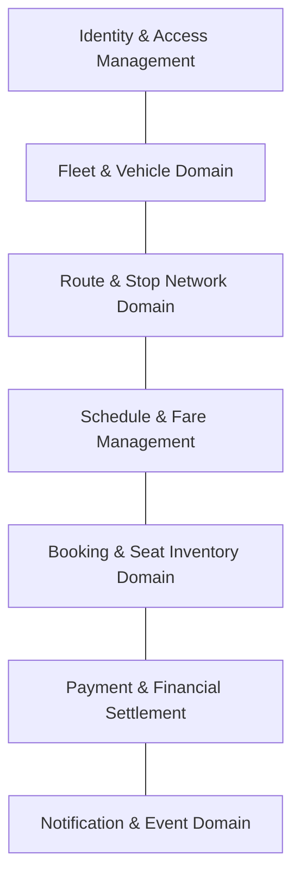
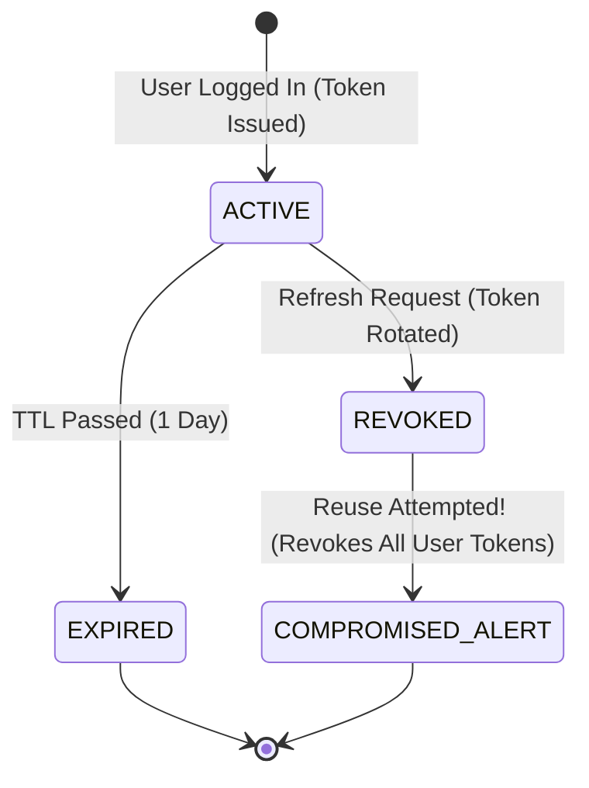
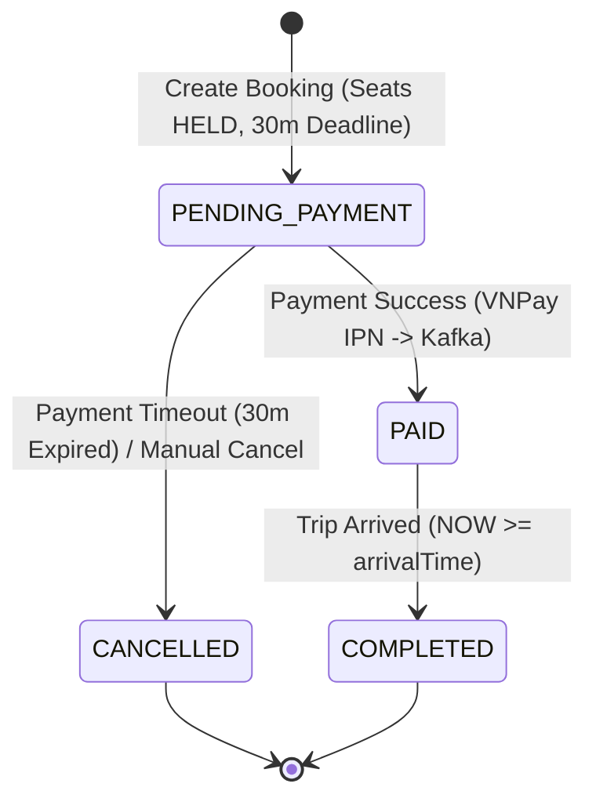
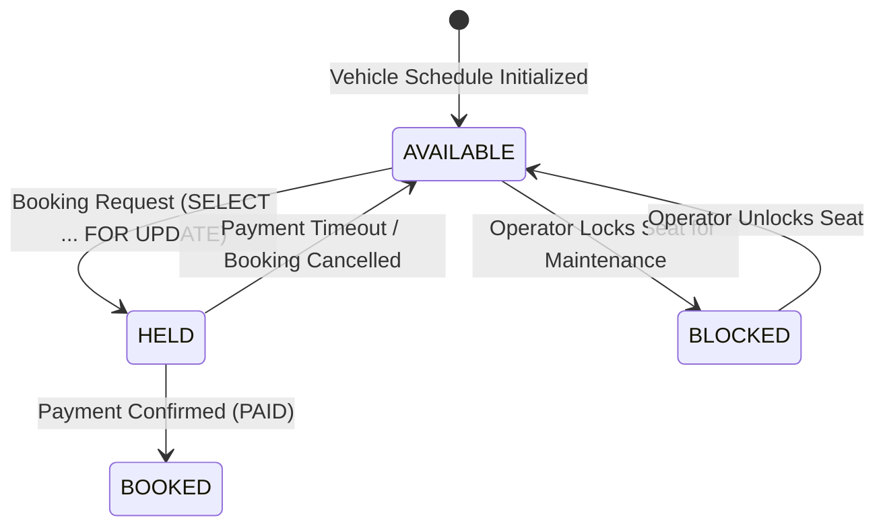
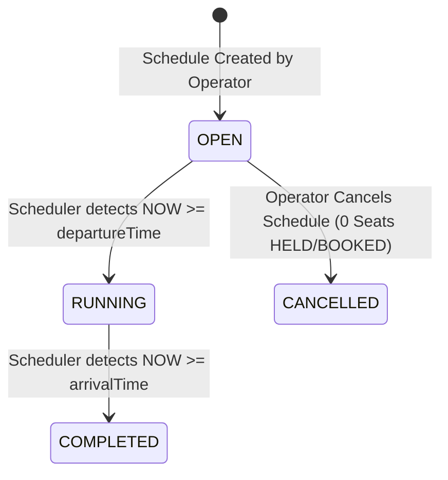
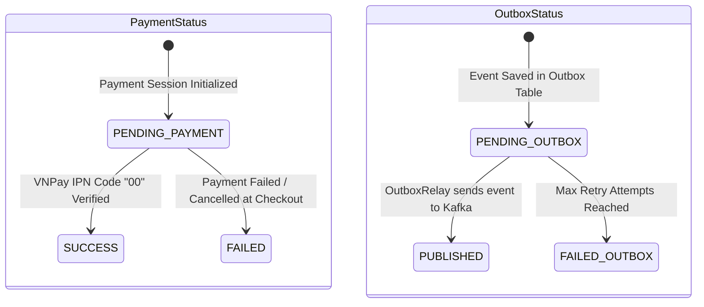

# Bus Booking System - Comprehensive Business Rules & Constraints

This document defines all business rules, domain specifications, validation constraints, state machine transitions, role permissions, error exception handling, and core system invariants for the **Bus Booking System**.

---

## 1. Business Domains

The system is organized into 7 primary business domains:

1. **Identity & Access Management (IAM)**: Governs user registration, account lifecycle (pending vs enabled), OTP verification, BCrypt password security, Refresh Token Rotation with compromised token reuse detection, and Role-Based Access Control (`ADMIN`, `OPERATOR`, `USER`).
2. **Fleet & Vehicle Domain**: Manages Operator profiles, `VehicleType` grid layouts (floors, rows, columns), `Vehicle` assets, and physical `Seat` layouts.
3. **Route & Stop Network Domain**: Manages geographical `City` entities, intercity `Route` paths, and ordered intermediate `RouteStop` checkpoints with pickup/drop-off flags.
4. **Schedule & Fare Management Domain**: Controls trip `Schedule` creation, vehicle schedule overlap prevention, pricing tiers (`basePrice` vs `vipPrice`), and real-time trip execution state.
5. **Booking & Seat Inventory Domain**: Handles seat map selection, pessimistic seat locking (`SELECT ... FOR UPDATE`), temporary seat reservation (`HELD`), 30-minute payment deadlines, and automated expiration cleanup.
6. **Payment & Financial Settlement Domain**: Manages VNPay checkout, IPN callback verification, transactional outbox logging, and operator financial analytics.
7. **Notification & Messaging Domain**: Consumes Kafka event streams to send transactional emails (OTP, invoices, trip departure reminders).

---

## 2. Business Rules

### 2.1. User & Account Lifecycle
* **Registration & Activation**: Newly registered users are created with `enabled = false`. An email OTP code valid for **10 minutes** is sent to the registered email address. Re-sending an OTP generates a new code valid for **15 minutes**.
* **Account Activation Requirement**: Unverified users (`enabled = false`) cannot log in or perform authenticated actions.
* **Password Encoding**: Passwords must be hashed using the **BCrypt** algorithm before persistence in MySQL (`users` DB).
* **Refresh Token Rotation & Reuse Detection**:
  * Every refresh request (`POST /auth/refresh-token`) invalidates the submitted refresh token (`revoked = true`) and issues a brand-new access token and a brand-new refresh token.
  * **Reuse Detection**: If a request presents an already-revoked refresh token (suspected token theft), the system immediately revokes **all** active refresh tokens associated with that user ID (`revokeAllUserTokens`) and rejects the request.
* **Role Elevation**: A standard user (`USER`) can be elevated to a bus operator (`OPERATOR`) only by an `ADMIN`.

### 2.2. Gateway & Traffic Security Rules
* **Redis-Backed IP Rate Limiting**: The API Gateway enforces client IP rate limiting via `RedisRateLimiter` configured with a replenish rate of **10 requests/second** and a burst capacity of **20 tokens**. If a client exceeds this limit, the gateway returns `429 Too Many Requests`.

### 2.3. Vehicle & Fleet Rules
* **Operator Profile Requirement**: An account with `OPERATOR` role must create an Operator profile (Company Name, Tax Code, Phone, Avatar) before registering vehicles or routes.
* **Tax Code Uniqueness**: Tax codes (`tax_code`) must be unique across all operators.
* **Physical Seat Map Generation**: Every vehicle must be linked to a `VehicleType`. Upon vehicle creation, physical `Seat` instances are automatically generated based on the grid dimensions ($\text{floors} \times \text{rows} \times \text{cols}$) defined by the `VehicleType`.
* **Vehicle Active Status**: Only vehicles in `ACTIVE` state can be assigned to schedules.

### 2.4. Route & Network Rules
* **City Validation**: Departure and Arrival cities must exist and cannot be identical ($\text{departureCityId} \neq \text{arrivalCityId}$).
* **Route Code Uniqueness**: Each route code (`route_code`) must be unique across the system.
* **Stop Sequential Order**: Route stops (`RouteStop`) must have a positive, strictly increasing `stopOrder` starting at 1. Each stop indicates whether passengers can be picked up (`isPickup`) or dropped off (`isDropOff`).

### 2.5. Schedule & Fare Rules
* **Time Consistency**: Departure time must strictly precede arrival time ($\text{departureTime} < \text{arrivalTime}$).
* **Ownership Constraint**: Operators can only schedule trips using vehicles and routes owned by their `operator_id`.
* **Vehicle Overlap Prevention Rule**: A single vehicle cannot be assigned to two overlapping schedules. When creating or updating a schedule for a vehicle, the system checks:
  $$\exists \text{ Schedule} \quad \text{where} \quad \text{New.Departure} < \text{Existing.Arrival} \quad \land \quad \text{New.Arrival} > \text{Existing.Departure}$$
  If an overlap is found, the schedule creation is rejected.
* **Automatic ScheduleSeat Initialization**: Creating a schedule automatically generates a `ScheduleSeat` entry for every physical seat on the vehicle. Prices are set to `vipPrice` for VIP seats and `basePrice` for regular seats.

### 2.6. Booking & Reservation Rules
* **Pessimistic Concurrency Protection**: Seat reservation (`POST /core/bookings`) locks target `ScheduleSeat` rows using `SELECT ... FOR UPDATE` within an isolated database transaction to guarantee zero double-bookings under high concurrency.
* **Temporary Seat Hold (`HELD`)**: Selected seats change state from `AVAILABLE` to `HELD`, and the booking is assigned status `PENDING_PAYMENT` with a **30-minute payment deadline** ($\text{paymentDeadline} = \text{createdAt} + 30 \text{ minutes}$).
* **Automated Expiration Sweep**: A background job (`BookingScheduler`) scans every minute for bookings in `PENDING_PAYMENT` where $\text{paymentDeadline} < \text{NOW}$. It releases held seats back to `AVAILABLE` and marks the booking `CANCELLED`.
* **Manual Booking Cancellation**: Customers can manually cancel bookings in `PENDING_PAYMENT` state, immediately releasing held seats to `AVAILABLE`.

### 2.7. Payment & Trip Lifecycle Rules
* **VNPay IPN Verification**: The Payment Service validates VNPay callback HMAC-SHA512 signatures and transaction amounts.
* **Outbox Pattern for Eventual Consistency**: Successful payments set Payment status to `SUCCESS` and insert a record into `outbox_event` in the same database transaction. An `OutboxRelay` scheduler publishes `payment-success` to Kafka.
* **Payment Consumption**: `core-service` consumes `payment-success` to transition booking status to `PAID` and seat statuses from `HELD` to `BOOKED`. `notification-service` sends a payment receipt email.
* **Automated Schedule State Transition**:
  * $\text{NOW} \ge \text{departureTime}$: Schedule status transitions from `OPEN` to `RUNNING`.
  * $\text{NOW} \ge \text{arrivalTime}$: Schedule status transitions from `RUNNING` to `COMPLETED`, and all linked `PAID` bookings transition to `COMPLETED`.
* **Schedule Cancellation Restriction**: An operator can ONLY cancel a schedule if its status is `OPEN` AND **zero seats** are currently in `HELD` or `BOOKED` state.

---

## 3. Validation Rules

| Entity / DTO | Field / Parameter | Validation Rule / Annotation | Failure Consequence |
| :--- | :--- | :--- | :--- |
| **User** | `email` | `@NotBlank`, `@Email` format | `400 Bad Request` |
| **User** | `password` | `@NotBlank`, min length 6, BCrypt encoded | `400 Bad Request` |
| **RefreshToken** | `refreshToken` | Must exist, `revoked = false`, not expired | `401 Unauthorized` |
| **Operator** | `taxCode` | `@NotBlank`, UNIQUE in DB | `400 Bad Request` / `409 Conflict` |
| **VehicleType** | `floors`, `rows`, `cols` | `@NotNull`, `@Min(1)` | `400 Bad Request` |
| **Vehicle** | `licensePlate` | `@NotBlank`, format validation | `400 Bad Request` |
| **Route** | `routeCode` | `@NotBlank`, UNIQUE in DB | `409 Conflict` |
| **Route** | `distance` | `@NotNull`, `@DecimalMin("0.0")` | `400 Bad Request` |
| **Schedule** | `departureTime`, `arrivalTime` | `@NotNull`, `arrivalTime > departureTime` | `400 Bad Request` |
| **Schedule** | `basePrice`, `vipPrice` | `@NotNull`, `@DecimalMin("0.0")` | `400 Bad Request` |
| **Booking** | `seatIds` | `@NotEmpty`, target seats must be `AVAILABLE` | `400 Bad Request` / Exception |

---

## 4. State Transitions

### 4.1. Refresh Token Lifecycle State Machine

---

### 4.2. Booking Status State Machine

| Initial State | Target State | Triggering Event | Side Effects |
| :--- | :--- | :--- | :--- |
| *None* | `PENDING_PAYMENT` | Passenger submits booking request | Target `ScheduleSeat` rows set to `HELD` with 30m deadline. |
| `PENDING_PAYMENT` | `PAID` | VNPay payment successful IPN callback | Linked seats set to `BOOKED`. Invoice email dispatched. |
| `PENDING_PAYMENT` | `CANCELLED` | 30-min deadline passes OR manual cancellation | Linked seats reset to `AVAILABLE` (`heldBy`, `heldAt` cleared). |
| `PAID` | `COMPLETED` | Scheduler detects trip arrival ($\text{NOW} \ge \text{arrivalTime}$) | Booking cycle completed successfully. |

---

### 4.3. ScheduleSeat Status State Machine

---

### 4.4. Schedule Status State Machine

---

### 4.5. Payment & Outbox State Machines

---

## 5. Permissions & RBAC Matrix

The system enforces granular Role-Based Access Control using JWT Authorities:

| API Endpoint / Action | `ROLE_ADMIN` | `ROLE_OPERATOR` | `ROLE_USER` | Public (Unauthenticated) |
| :--- | :---: | :---: | :---: | :---: |
| `POST /auth/login`, `POST /auth/register` | ✅ | ✅ | ✅ | ✅ |
| `POST /auth/refresh-token` (Rotates Token) | ✅ | ✅ | ✅ | ✅ |
| `GET /auth/.well-known/jwks.json` | ✅ | ✅ | ✅ | ✅ |
| `GET /core/schedules/search`, `GET /core/cities` | ✅ | ✅ | ✅ | ✅ |
| `POST /core/bookings` (Hold Seats) | ❌ | ❌ | ✅ | ❌ |
| `POST /payments/vnpay/create-payment` | ❌ | ❌ | ✅ | ❌ |
| `GET /payments/vnpay/ipn` | ❌ | ❌ | ❌ | ✅ (VNPay Webhook) |
| `GET /core/bookings/my-bookings` | ❌ | ❌ | ✅ | ❌ |
| `POST /core/operators` (Register Operator Profile) | ❌ | ✅ | ❌ | ❌ |
| `POST /core/vehicles`, `POST /core/routes` | ❌ | ✅ (Owned) | ❌ | ❌ |
| `POST /core/schedules` (Create Schedule) | ❌ | ✅ (Owned) | ❌ | ❌ |
| `GET /core/statistics/**` (Revenue Analytics) | ❌ | ✅ (Owned) | ❌ | ❌ |
| `PUT /users/{id}/status` (Lock/Unlock Account) | ✅ | ❌ | ❌ | ❌ |
| `POST /users/{id}/promote-to-operator` | ✅ | ❌ | ❌ | ❌ |
| `POST /core/vehicle-types` (Manage Layouts) | ✅ | ❌ | ❌ | ❌ |
| `POST /auth/service-clients` (Manage App Clients) | ✅ | ❌ | ❌ | ❌ |

---

## 6. Error Cases & Exception Handling

| HTTP Status Code | Exception Class | Common Cause / Trigger Condition | Error Response Payload |
| :--- | :--- | :--- | :--- |
| `400 Bad Request` | `MethodArgumentNotValidException` | DTO field validation failed (e.g. invalid email format, negative price) | `{"status": 400, "message": "Validation failed", "errors": [...]}` |
| `400 Bad Request` | `IllegalStateException` | Invalid domain state transition (e.g. cancelling schedule with active seats) | `{"status": 400, "message": "Cannot cancel schedule with booked seats"}` |
| `401 Unauthorized` | `AuthenticationFailedException` | Invalid username/password OR revoked refresh token reuse attempt | `{"status": 401, "message": "Revoked refresh token detected"}` |
| `403 Forbidden` | `AccessDeniedException` | User lacks required JWT role authority for the endpoint | `{"status": 403, "message": "Access Denied"}` |
| `404 Not Found` | `RouteNotFoundException` | Specified route ID does not exist | `{"status": 404, "message": "Route not found"}` |
| `404 Not Found` | `ScheduleNotFoundException` | Specified schedule ID does not exist | `{"status": 404, "message": "Schedule not found"}` |
| `404 Not Found` | `BookingNotFoundException` | Specified booking ID/code does not exist | `{"status": 404, "message": "Booking not found"}` |
| `409 Conflict` | `RouteCodeAlreadyExistsException` | Attempted to create a route with a duplicate `routeCode` | `{"status": 409, "message": "Route code already exists"}` |
| `409 Conflict` | `OperatorAlreadyRegisterException` | Account already registered an operator profile | `{"status": 409, "message": "Operator already registered"}` |
| `429 Too Many Requests` | *Gateway Filter* | Client exceeded API Gateway rate limit (10 req/s, burst 20) | `{"status": 429, "message": "Too Many Requests"}` |
| `500 Internal Error` | `GlobalException` / Unhandled | Unexpected runtime failure or infrastructure connectivity issue | `{"status": 500, "message": "Internal server error"}` |

---

## 7. Core System Invariants

The following invariants MUST hold true under all operating conditions:

1. **No Double-Booking Invariant**:
   $$\forall s \in \text{ScheduleSeats}, \quad \text{Status}(s) \in \{\text{HELD}, \text{BOOKED}\} \implies |\{\text{Active Bookings holding } s\}| = 1$$
   No physical seat on a specific schedule can be concurrently linked to more than one non-cancelled booking.

2. **Refresh Token Single-Use Invariant**:
   $$\forall r \in \text{RefreshTokens}, \quad \text{Rotated}(r) \implies \text{Revoked}(r) = \text{true}$$
   A refresh token can be used at most once to issue new tokens. Subsequent presentation of a revoked token MUST trigger full session invalidation for that user.

3. **Price Non-Negativity Invariant**:
   $$\text{basePrice} \ge 0, \quad \text{vipPrice} \ge 0, \quad \text{seat.price} \ge 0, \quad \text{booking.totalAmount} \ge 0$$

4. **Time Ordering Invariant**:
   $$\forall \text{ Schedule } s, \quad s.\text{departureTime} < s.\text{arrivalTime}$$

5. **Seat Count Consistency Invariant**:
   $$\forall \text{ Schedule } s, \quad \text{Count}(\text{AVAILABLE}) + \text{Count}(\text{HELD}) + \text{Count}(\text{BOOKED}) + \text{Count}(\text{BLOCKED}) = s.\text{totalSeats}$$

6. **Transactional Outbox Atomicity Invariant**:
   $$\text{PaymentStatus} \rightarrow \text{SUCCESS} \iff \text{OutboxEvent}(\text{payment-success}) \text{ created in same SQL Transaction}$$
   Payment status updates and outbox message insertions MUST commit or rollback atomically together.

7. **Operator Scope Isolation Invariant**:
   $$\forall \text{ Schedule } s \text{ created by Operator } O, \quad s.\text{vehicle}.\text{operatorId} = O.\text{id} \quad \land \quad s.\text{route}.\text{operatorId} = O.\text{id}$$
   An operator can never create a schedule using assets owned by another operator.
